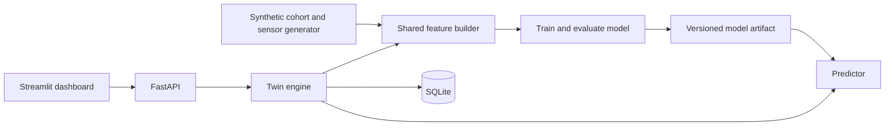

# Architecture

```mermaid
flowchart LR
  SYN[Synthetic cohort and sensor generator] --> FEAT[Shared feature builder]
  FEAT --> TRAIN[Train and evaluate model]
  TRAIN --> ART[Versioned model artifact]
  API[FastAPI] --> ENG[Twin engine]
  ENG --> FEAT
  ENG --> DB[(SQLite)]
  ART --> PRED[Predictor]
  ENG --> PRED
  DASH[Streamlit dashboard] --> API
```

The clinical-only model is trained and evaluated on synthetic longitudinal data. Sensor observations demonstrate twin-state updates only; no clinical benefit is claimed.
